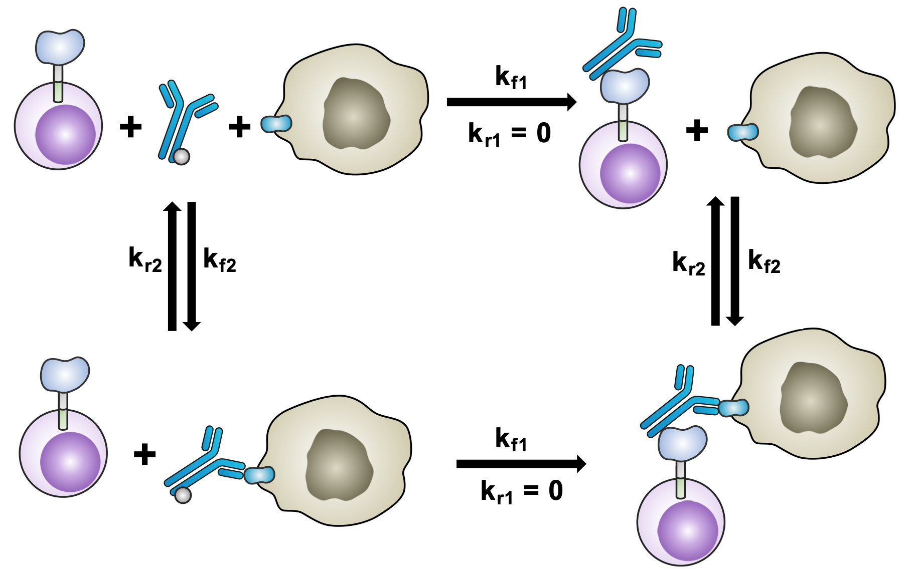

# TernaryBody

## Modeling T cell - Antibody - Tumor Cell binding

The purpose of this model is to investigate the formation of T cell bound antibody to Tumor cell antigen. This type of problem is commonly refered to as a Ternary Body model or a Scaffolding Protein model. With this mondel, we investigate the kintematics and equilibrium state of a ternary body model in the specific context of T cell - Antibody - Tumor cell targetting.

## Citation

Lohmueller, Jason, et al. "Post-translational covalent assembly of CAR and synNotch receptors for programmable antigen targeting." bioRxiv (2020): 2020-01.

## Funding

This work was supported by NIH grant R01 GM142007 (J.L., A.D.); NIH grant R35 CA210039 (O.J.F.); NIH grant R21 AI130815 (A.D.); DARPA award W911NF-17-1-0135 (N.M-Z.); AIRC postdoctoral fellowship 22321 (E.R.); and by the Michael G. Wells Prize (J.L.). This work benefitted from using the SPECIAL BD LSRFORTESSA funded by NIH 1S10OD011925-01. This project also used the Hillman Animal Facility, In Vivo Imaging Facility, and Cytometry Facility that are supported in part by award P30CA047904.
